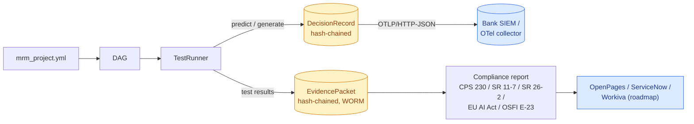
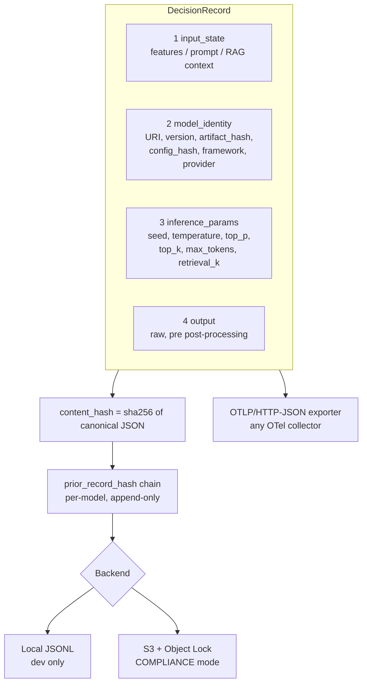
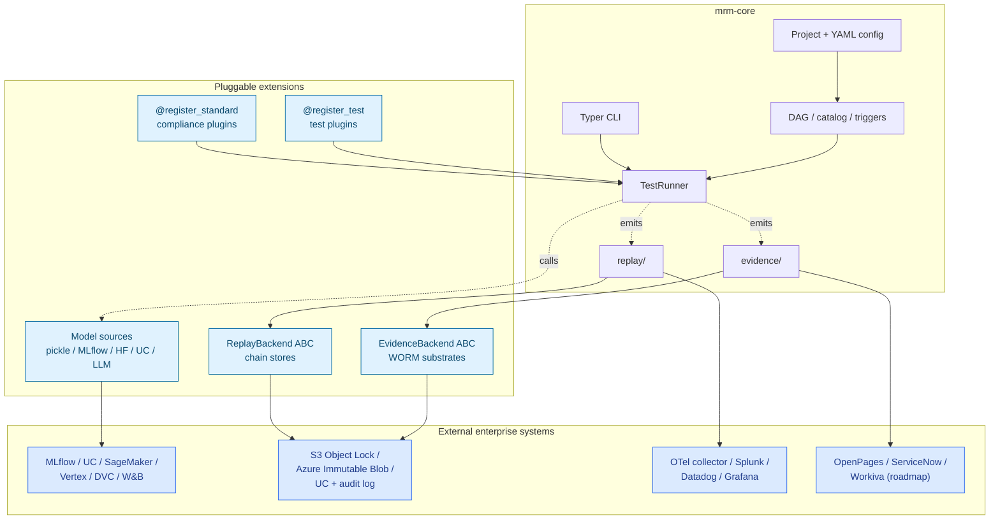
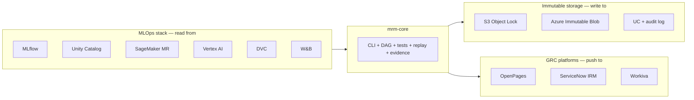

# `mrm-core`

> **dbt for Model Risk Management — with replay by default.**
>
> A declarative, version-controlled, plugin-extensible CLI for validating
> traditional, AI, and GenAI models against regulator-shaped standards.
> Every model invocation is captured as a tamper-evident, hash-chained,
> OTLP-exportable `DecisionRecord`.

[](mrm-core/LICENSE)
[](mrm-core/pyproject.toml)
[](mrm-core/docs/spec/README.md)
[](mrm-core/docs/CROSSWALK.md)

---

## Why this exists

Regulators (Fed, APRA, OSFI, EU AI Office) now expect financial
institutions to prove **how every model decision was made, on demand,
across a multi-year retention window**. Today that proof lives in
Excel, SharePoint, and screenshots stapled into GRC suites. That
shape does not survive the 2026–2027 regulatory wave:

| Date | Event |
|---|---|
| 1 Jul 2025 | APRA CPS 230 fully effective |
| 30 Apr 2026 | APRA industry-wide AI letter + CPS 230 amendments |
| 2 Aug 2026 | EU AI Act fully applicable |
| 2026–2027 | Fed SR 11-7 → **SR 26-2** transition (AI activity logging mandate) |
| 1 May 2027 | OSFI E-23 effective (expanded to all FRFIs incl. insurers) |
| 2 Aug 2027 | EU AI Act high-risk obligations (embedded systems) |

`mrm-core` is built for the world after those dates: declarative
config, version-controlled validation, immutable evidence, and 1:1
replay of every decision a model makes.

---

## The 30-second mental model



You write a YAML project, declare your models and their tests, point
the runner at a backend, and you get back:

1. **Evidence packets** — hash-chained, WORM-stored, regulator-shaped.
2. **Decision records** — every inference, replayable byte-for-byte.
3. **Compliance reports** — paragraph-mapped to four jurisdictions.

---

## Feature coverage

### Compliance jurisdictions (bundled, pluggable)

| Standard | Jurisdiction | Status | Source |
|---|---|---|---|
| **APRA CPS 230** | Australia | Bundled | [`builtin/cps230.py`](mrm-core/mrm/compliance/builtin/cps230.py) |
| **Federal Reserve SR 11-7** | US | Bundled | [`builtin/sr117.py`](mrm-core/mrm/compliance/builtin/sr117.py) |
| **EU AI Act Annex IV** | EU | Bundled | [`builtin/eu_ai_act.py`](mrm-core/mrm/compliance/builtin/eu_ai_act.py) |
| **OSFI E-23** | Canada | Bundled | [`builtin/osfi_e23.py`](mrm-core/mrm/compliance/builtin/osfi_e23.py) |
| **Federal Reserve SR 26-2** | US (supersedes SR 11-7 for banks >$30B) | Bundled | [`builtin/sr26_2.py`](mrm-core/mrm/compliance/builtin/sr26_2.py) |
| **Cross-standard crosswalk** | 27 concepts × 5 standards (incl. SR 11-7 → SR 26-2 transition) | Shipped | [`CROSSWALK.md`](mrm-core/docs/CROSSWALK.md) |
| **NIST AI RMF, ECB Internal Models** | crosswalk targets | Roadmap | — |

Plugins are discovered three ways — bundled, pip-installed via the
`mrm.compliance` entry-point group, or local paths declared in
`mrm_project.yml`. See [ADR-0001](mrm-core/docs/adr/0001-pluggable-compliance-standards.md).

### Validation tests (built-in, namespaced, pluggable)

| Namespace | Domain | Notes |
|---|---|---|
| `tabular.*` | Missing values, drift, leakage, calibration, discrimination, stability | Pandas-shaped data |
| `ccr.*` | Monte Carlo convergence, EPE/PFE bounds, antithetic variates, copula fit | Counterparty credit risk |
| `model.*` | Performance, bias, fairness, explainability | Cross-cutting |
| `genai.*` | Hallucination, bias, robustness, toxicity, drift, PII, latency, cost | 14 tests across 7 categories |
| `compliance.*` | Governance checks per standard | One pack per jurisdiction |

Test packs are pluggable via `@register_test`. The roadmap adds a
50+-template adversarial pack and financial-F1 entity-weighted accuracy
([P10](STRATEGY.md)).

### Model sources

| Source | Adapter | Replay-aware |
|---|---|---|
| Local pickle / joblib | `_load_pickle` | Yes via `instrument_predictor` |
| Python class | `_load_python_class` | Yes  |
| MLflow registry | `_load_mlflow_model` | Yes  |
| HuggingFace Hub | `_load_huggingface_model` | Yes  |
| S3 / GCS / Azure URIs | `_load_s3_model` | Yes  |
| Databricks Unity Catalog | UC backend | Yes  |
| **LLM endpoints** | LiteLLM + legacy adapters | Yes prompt + retrieval + decoding params auto-captured |

### Replay primitive

Every model invocation captures the four components required for
reconstruction:



| Capability | OSS | Cloud *(roadmap)* |
|---|---|---|
| Hash-chained `DecisionRecord` | Yes  | Yes |
| `@capture` decorator + `CaptureContext` | Yes  | Yes |
| Auto-capture inside `TestRunner` for **every** model archetype | Yes  | Yes |
| Local JSONL backend | Yes  | — |
| S3 + Object Lock backend | Yes  | Yes managed |
| OTLP/HTTP-JSON export | Yes  | Yes |
| `mrm replay record / reconstruct / verify / sample / verify-chain` | Yes  | Yes |
| HSM-backed signing (FIPS 140-2 L3+) | — | Yes ([P9](STRATEGY.md)) |
| Regulator-portal sample export | — | Yes  |
| 7-year retention SLA | — | Yes  |

Reference specs: [Decision Record v1](mrm-core/docs/spec/replay-record-v1.md).
ADR: [Replay as first-class](mrm-core/docs/adr/0003-replay-as-first-class-primitive.md).

### Evidence vault

| Capability | OSS | Cloud *(roadmap)* |
|---|---|---|
| Hash-chained `EvidencePacket` | Yes  | Yes |
| Local + S3 Object Lock backends | Yes  | Yes managed |
| GPG / age signatures | Yes  | — |
| Daily Merkle root publication | Planned [P9](STRATEGY.md) | Yes  |
| HSM-backed root signing | — | Yes  |
| Conformance test-vector suite | Planned [P9](STRATEGY.md) | — |

Spec: [Evidence Vault v1](mrm-core/docs/spec/evidence-vault-v1.md).
ADR: [Content-addressed hash chains](mrm-core/docs/adr/0002-evidence-vault-hash-chain.md).

### dbt-style workflow primitives

| Feature | Shape |
|---|---|
| **DAG** | `depends_on:` in YAML, topological sort, parallel execution |
| **`ref()`** | Reference other models by name |
| **Graph operators** | `+model`, `model+`, `+model+` |
| **`--select`** | `mrm test --select tier:tier_1 --select tag:credit` |
| **`mrm docs generate`** | Compile compliance reports, like `dbt docs generate` |
| **Validation triggers** | scheduled, drift, breach, materiality, regulatory, manual |

---

## What it looks like

A model declared in YAML:

```yaml
models:
  - name: ccr_monte_carlo
    version: 1.4.0
    tier: tier_1
    location:
      type: file
      path: artifacts/ccr_v140.pkl
    depends_on:
      - market_data_curve
    tests:
      - test: ccr.MCConvergence
        params: { paths: 100000, tolerance: 1e-3 }
      - test: ccr.EPEBounds
        compliance:
          cps230: ["27", "28"]
          sr117:  ["III.A", "V.B"]
          eu_ai_act: ["Annex IV §2.b"]
```

One CLI invocation compiles the whole thing into evidence + reports +
replay:

```bash
mrm test --select ccr_monte_carlo
mrm docs generate ccr_monte_carlo --compliance standard:cps230,sr117,eu_ai_act
mrm evidence freeze ccr_monte_carlo --backend s3 --bucket bank-evidence --retention 2555
mrm replay sample --model ccr_monte_carlo --since 2026-01-01 --n 50
```

---

## CLI surface at a glance

```
mrm init <project>                   # scaffold new project
mrm list  models|tests|suites        # introspect
mrm test  [--select ...] [--threads N]
mrm docs  generate|list-standards|crosswalk
mrm evidence  freeze|verify|list
mrm replay  record|reconstruct|verify|sample|verify-chain
mrm triggers  check|list|run
mrm catalog  list|publish|sync          # Databricks UC + MLflow
mrm debug  --show-config|--show-dag|--show-catalog
```

Full help: `mrm <command> --help`.

---

## Architectural plug points



Five plug points, all behind small, versioned contracts. The
contracts are documented in [`docs/spec/`](mrm-core/docs/spec/).

---

## Quick start

```bash
# install
git clone https://github.com/dbose/mrm.git
cd mrm/mrm-core
pip install -e .

# run the canonical CCR Monte Carlo example end-to-end
cd ccr_example
python setup_ccr_example.py     # synthetic data + pickled model
python run_validation.py        # 8 tests + triggers + report

# or via the CLI
mrm docs generate ccr_monte_carlo --compliance standard:cps230
mrm replay record   ccr_monte_carlo --inputs trade_book.csv
mrm replay verify   <record-id> --tolerance 1e-6
mrm replay sample   --model ccr_monte_carlo --n 10
mrm evidence freeze ccr_monte_carlo --backend local
```

A worked GenAI example is under [`genai_example/`](mrm-core/genai_example/)
— a RAG customer-service assistant validated end-to-end against CPS
230 and EU AI Act mappings.

---

## Worked examples

| Example | Domain | Models | Standards exercised |
|---|---|---|---|
| [`ccr_example/`](mrm-core/ccr_example/) | Counterparty credit risk | Monte Carlo simulation | CPS 230, SR 11-7, EU AI Act |
| [`credit_risk_example/`](mrm-core/credit_risk_example/) | PD / LGD scoring | scikit-learn classifier | CPS 230, SR 11-7 |
| [`genai_example/`](mrm-core/genai_example/) | RAG customer service | LiteLLM + FAISS | CPS 230, EU AI Act |

The CCR example is the de-facto integration test for the framework as
a whole. If a change breaks `python run_validation.py`, the change is
broken.

XVA via ORE and IRB credit-risk examples are next ([P13](STRATEGY.md), [P14](STRATEGY.md)).

---

## How `mrm-core` integrates, doesn't replace



`mrm-core` is the **glue between MLOps and GRC**, not a replacement
for either.

---

## Spec and governance posture

Production-grade open-source MRM is unusual; we treat the public
contracts as formal specs from day one.

- [`GOVERNANCE.md`](mrm-core/GOVERNANCE.md) — maintainer model, spec
  lifecycle, intent to transition to a neutral foundation
  (OpenSSF / CNCF / FINOS) once adoption thresholds are met.
- [`docs/adr/`](mrm-core/docs/adr/) — Architecture Decision Records
  for every load-bearing design choice (5 ADRs and counting).
- [`docs/spec/`](mrm-core/docs/spec/) — PRD-2 specs for:
  - [Decision Record v1](mrm-core/docs/spec/replay-record-v1.md)
  - [Evidence Vault Chain v1](mrm-core/docs/spec/evidence-vault-v1.md)
  - [Compliance Plugin Contract v1](mrm-core/docs/spec/compliance-plugin-v1.md)
- [`STRATEGY.md`](STRATEGY.md) — public roadmap with each feature's
  status, OSS / Cloud tier, and wedge thesis.

---

## Project layout

```
mrm-core/
├── mrm/
│   ├── cli/                       Typer CLI
│   ├── core/                      Project loading, DAG, catalog, triggers
│   │   └── catalog_backends/      Databricks UC + MLflow integration
│   ├── compliance/                Pluggable regulatory standards
│   │   └── builtin/               cps230 · sr117 · eu_ai_act · osfi_e23
│   ├── tests/                     Pluggable test framework
│   │   └── builtin/               tabular · ccr · model · genai
│   ├── engine/runner.py           Test runner with replay wiring
│   ├── evidence/                  Hash-chained evidence vault
│   │   └── backends/              local · s3_object_lock
│   ├── replay/                    1:1 Decision Replay (NEW)
│   │   ├── record.py              DecisionRecord schema
│   │   ├── capture.py             @capture decorator + context manager
│   │   ├── instrument.py          Universal predictor + LLM capture
│   │   ├── otlp.py                OTLP/HTTP-JSON exporter
│   │   ├── verify.py              reconstruct + diff
│   │   └── backends/              local · s3
│   └── backends/                  Storage backends + LLM adapters
├── docs/
│   ├── adr/                       Architecture Decision Records
│   ├── spec/                      Normative versioned specs (PRD-2)
│   ├── guides/                    User-facing walkthroughs
│   └── CROSSWALK.md               Cross-standard mapping
├── ccr_example/                   Canonical CCR Monte Carlo example
├── credit_risk_example/           Credit risk PD example
└── genai_example/                 RAG customer-service example
```

---

## Status

**Done (shipped):**

- CLI with dbt-style ergonomics
- DAG, `ref()`, graph operators, topological sort, parallel execution
- Built-in tests across 4 namespaces (tabular · ccr · model · genai)
- Four bundled jurisdictions (AU / US / EU / CA), plus **Fed SR 26-2** (AI-specific successor to SR 11-7)
- Cross-standard crosswalk (27 concepts × 5 standards, with explicit SR 11-7 → SR 26-2 transition map)
- Validation trigger engine (6 trigger types)
- Databricks UC + MLflow + HuggingFace integration
- Evidence vault — hash-chained packets, S3 Object Lock backend
- GenAI test pack — 14 tests, LiteLLM unified interface, RAG validation
- **1:1 Decision Replay — DecisionRecord, capture, OTLP, verify, backends, CLI**
- Replay capture for **all** model types — sklearn, HF, MLflow, LiteLLM, legacy LLM adapters
- ADRs + spec PRDs + GOVERNANCE.md posture

**Next:** SR 26-2 plugin, cryptographic vault hardening (Merkle roots,
HSM signing), 50+-template adversarial pack, GRC connectors.
See [STRATEGY.md](STRATEGY.md).

---

## Contributing

PRs welcome. Read [CONTRIBUTING.md](mrm-core/CONTRIBUTING.md) and
[GOVERNANCE.md](mrm-core/GOVERNANCE.md) first. Non-trivial
architectural changes need an [ADR](mrm-core/docs/adr/template.md).

## License

Apache 2.0 — see [LICENSE](mrm-core/LICENSE).
